# 🧩 MUMMY MAZE – AI PROJECT

# Báo cáo Đồ án Nhóm Trí tuệ Nhân tạo

## Đề tài: Giải bài toán **Mummy Maze** bằng các **thuật toán tìm kiếm trong AI**

Giảng viên hướng dẫn: **TS. Phan Thị Huyền Trang**  
Nhóm sinh viên thực hiện:  
- **Nguyễn Hoàng Giáp – 23110096**  
- **Nguyễn Thành Vinh – 23110172**  
- **Dương Minh Duy – 23110083**  

Ngày báo cáo: *Tháng 10 năm 2025 (Học Kì I)*  

---

## 🎯 1. Mục tiêu

Mục tiêu của dự án là xây dựng một **ứng dụng trò chơi trí tuệ Mummy Maze** sử dụng **Python – Pygame**, cho phép mô phỏng trực quan quá trình tìm đường của người chơi trong mê cung có chướng ngại vật và kẻ địch (xác ướp).

Ứng dụng giúp:
- Minh họa hoạt động của **các thuật toán tìm kiếm trong Trí tuệ Nhân tạo**.  
- So sánh **hiệu suất giữa các thuật toán** (thời gian, số node mở rộng, độ dài đường đi).  
- Cung cấp **giao diện sinh động, có âm thanh và hoạt ảnh**, giúp người học dễ hiểu hơn về cách thuật toán vận hành.

---

## 🧠 2. Cơ sở lý thuyết

### 2.1. **Mô hình bài toán Mummy Maze**

Bài toán được biểu diễn dưới dạng **một bài toán tìm kiếm trạng thái (State Space Search Problem)**, với các thành phần:

| Thành phần | Ký hiệu | Mô tả |
|-------------|----------|-------|
| **Trạng thái (State)** | `S` | Gồm vị trí của Player, Mummy, cửa thoát và các bức tường. |
| **Trạng thái khởi đầu (Initial State)** | `S₀` | Vị trí ban đầu của Player và Mummy. |
| **Tập hành động (Actions)** | `A(S)` | Các hướng di chuyển hợp lệ: Lên, Xuống, Trái, Phải. |
| **Hàm chuyển trạng thái (Transition)** | `Result(S, a)` | Trạng thái mới khi thực hiện hành động `a`. |
| **Mục tiêu (Goal)** | `G` | Player đến được vị trí cửa thoát mà không bị Mummy bắt. |
| **Hàm chi phí (Cost)** | `g(n)` | Số bước đi, hoặc tổng chi phí các hành động đã thực hiện. |
| **Hàm heuristic (Heuristic)** | `h(n)` | Ước lượng khoảng cách từ trạng thái hiện tại đến đích. |
| **Hàm tổng chi phí (Evaluation Function)** | `f(n) = g(n) + h(n)` | Được dùng trong các thuật toán có heuristic (như A*). |

### 2.2. **Phân loại thuật toán tìm kiếm**

1. **Tìm kiếm mù (Uninformed Search)**  
   Không dùng thông tin về khoảng cách đến đích; mở rộng nút theo cấu trúc không gian trạng thái.  
   *Ví dụ:* **BFS**, **DFS**, **IDS**, **UCS** (tối ưu khi chi phí bước đồng nhất).

2. **Tìm kiếm có thông tin (Informed Search)**  
   Sử dụng heuristic `h(n)` để ước lượng “độ gần” đích và ưu tiên mở rộng trạng thái hứa hẹn.  
   *Ví dụ:* **Greedy Best-First** (`f = h`), **A\*** (`f = g + h`).

3. **Tìm kiếm cục bộ (Local/Stochastic Search)**  
   Không xây dựng cây tìm kiếm; làm việc trực tiếp trên **một cấu hình đầy đủ**, cải thiện dần theo hàm mục tiêu (có thể chấp nhận bước “xấu hơn” để thoát kẹt).  
   *Ví dụ:* **Hill-Climbing**, **Simulated Annealing**.

4. **Tìm kiếm trong môi trường phức tạp** *(đối kháng, không chắc chắn, thiếu quan sát)*  
   Xử lý nhiều tác nhân, rẽ nhánh theo điều kiện, hoặc **không quan sát đầy đủ**; trạng thái có thể là **belief state** (tập các khả năng).  
   - *Trong Mummy Maze:* xác ướp di chuyển theo quy tắc (nút **AND**), bẫy ẩn/ô chưa biết (**partial observation**), hành vi môi trường gây ra nhiều kết cục.  
   - *Kỹ thuật tiêu biểu:* **AND-OR Search** (tách **nút hành động OR** và **nút điều kiện AND**), **lập kế hoạch trên belief state** (kế hoạch đúng với mọi khả năng).  
   - *Khi dùng:* Khi cần **kế hoạch có điều kiện/dự phòng** thay vì một chuỗi hành động cố định.

5. **Tìm kiếm có ràng buộc (Constraint-Based / CSP)**  
   Mô hình hoá bài toán bằng **biến – miền – ràng buộc**; mục tiêu là tìm gán trị thoả tất cả ràng buộc.  
   - *Trong Mummy Maze:* biến là vị trí theo thời gian `X₀..X_T`; miền là các ô hợp lệ; ràng buộc gồm **kề hợp lệ**, **không xuyên tường**, **không vào bẫy**, **đến Goal đúng thời điểm**.  
   - *Kỹ thuật tiêu biểu:* **Backtracking** (quay lui), **AC-3** (duy trì nhất quán cung để cắt tỉa miền trước/trong tìm kiếm).  
   - *Khi dùng:* Khi cần **đảm bảo tính hợp lệ chặt chẽ** của đường đi theo quy tắc bản đồ/trap/mummy.

---

## ⚙️ 3. Các thuật toán đã triển khai

> Dự án nhóm phân loại thành **5 nhóm – 15 thuật toán** như sau:  
> 1) **Uninformed**: BFS, DFS, IDS, UCS  
> 2) **Informed**: Greedy, A*  
> 3) **Heuristic Width-Limited**: Beam Search  
> 4) **Local/Stochastic**: Hill-Climbing, Simulated Annealing  
> 5) **CSP & Môi trường phức tạp/không chắc chắn**: AND-OR (Non-Deterministic Env), Belief-State Search, Partial Observation, Backtracking, Forward Backtracking, AC-3

---

### 3.1. **Uninformed Search**

#### 🔹 **Breadth-First Search (BFS)**
- **Ý tưởng:** Mở rộng theo từng tầng; tối ưu khi chi phí bước đồng nhất.  
- **Độ phức tạp:** Thời gian `O(b^d)`; Không gian `O(b^d)`.  
- **Ưu/nhược:** Tối ưu độ dài đường đi; **rất tốn bộ nhớ**.

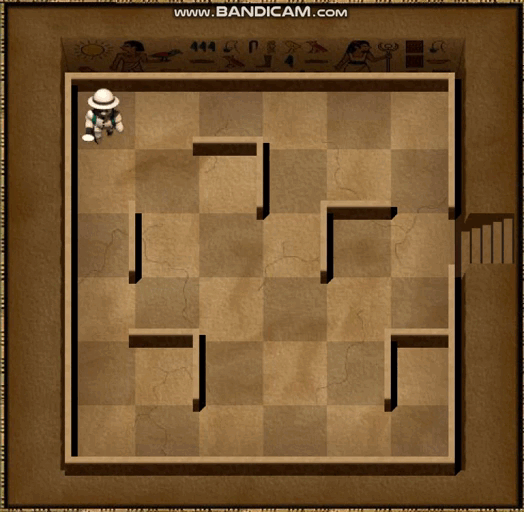

---

#### 🔹 **Depth-First Search (DFS)**
- **Ý tưởng:** Đi sâu nhất có thể rồi quay lui khi bế tắc.  
- **Độ phức tạp:** Thời gian `O(b^m)`; Không gian `O(bm)`.  
- **Ưu/nhược:** **Ít bộ nhớ**, cài đặt đơn giản; **không tối ưu**, dễ lạc hướng.

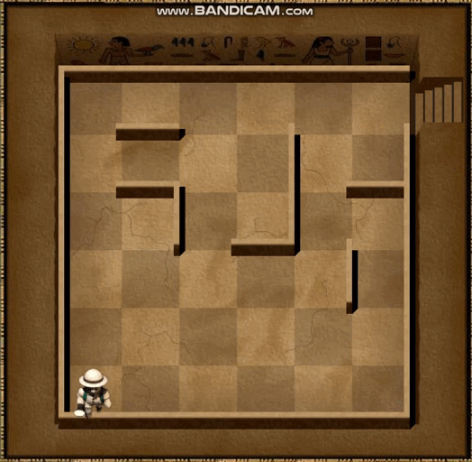

---

#### 🔹 **Iterative Deepening Search (IDS)**
- **Ý tưởng:** Lặp DFS với **giới hạn độ sâu tăng dần**, kết hợp ưu điểm BFS/DFS.  
- **Độ phức tạp:** Gần `O(b^d)` về thời gian; không gian như DFS.  
- **Ưu/nhược:** **Đầy đủ & tối ưu** khi cost đồng nhất; mở lại các nút tầng nông nhiều lần.

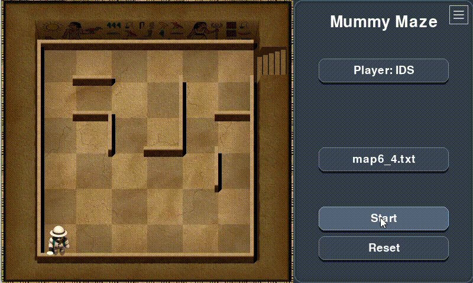

---

#### 🔹 **Uniform Cost Search (UCS)**
- **Ý tưởng:** Luôn mở rộng nút có **chi phí tích lũy nhỏ nhất** `g(n)`.  
- **Hàm đánh giá:** `f(n) = g(n)` (cost thực).  
- **Ưu/nhược:** **Tối ưu** cho mọi cost dương; có thể **chậm** khi nhiều nhánh có cost gần nhau.

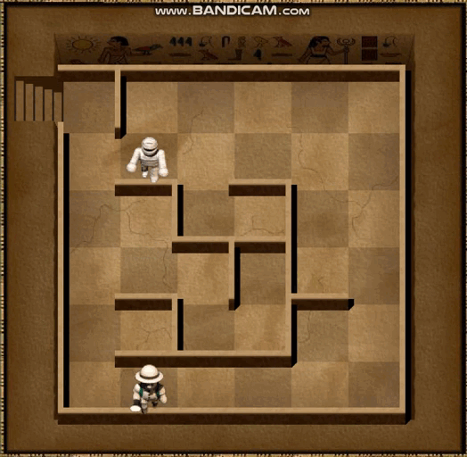

---

### 3.2. **Informed Search**

#### 🔹 **Greedy Best-First Search**
- **Ý tưởng:** Chọn nút có **heuristic** nhỏ nhất.  
- **Hàm đánh giá:** `f(n) = h(n)`.  
- **Ưu/nhược:** **Rất nhanh**, hướng đích tốt; **không tối ưu**, dễ “thiển cận”.

    
     
    

---

#### 🔹 **A\* Search**
- **Ý tưởng:** Cân bằng chi phí thật và ước lượng.  
- **Hàm đánh giá:** `f(n) = g(n) + h(n)`.  
- **Ưu/nhược:** **Tối ưu** nếu `h` không vượt/nhất quán; **tốn RAM** hơn Greedy.

---

### 3.3. **Heuristic Width-Limited**

#### 🔹 **Beam Search**
- **Ý tưởng:** Mỗi tầng chỉ giữ **k** ứng viên tốt nhất theo `h(n)` (beam width).  
- **Ưu/nhược:** Tiết kiệm bộ nhớ, tốc độ tốt; có thể **loại sớm** đường tối ưu.

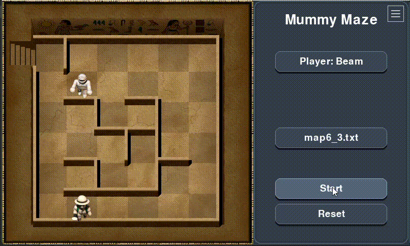

---

### 3.4. **Local / Stochastic Search**

#### 🔹 **Hill-Climbing (HC)**
- **Ý tưởng:** Luôn chuyển sang láng giềng cải thiện mục tiêu (giảm `f`/tăng điểm).  
- **Ưu/nhược:** **Nhanh, rất ít bộ nhớ**; **dễ kẹt** cực trị cục bộ/plateau.

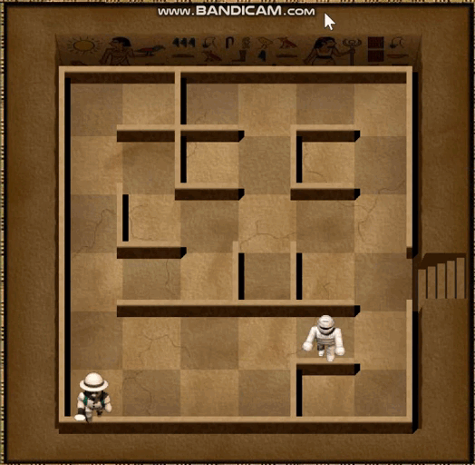

---

#### 🔹 **Simulated Annealing (SA)**
- **Ý tưởng:** Cho phép nhận bước kém hơn với xác suất `P = e^(−ΔE/T)` để thoát kẹt; `T` giảm dần.  
- **Ưu/nhược:** Dễ **thoát kẹt** hơn HC; phụ thuộc **lịch nhiệt**.

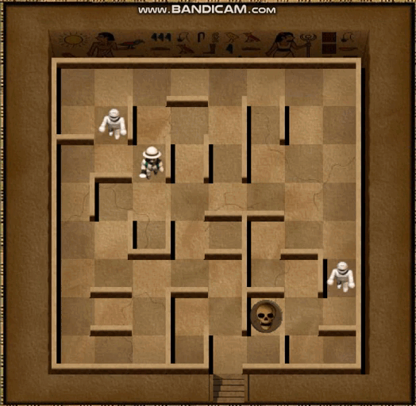

---

### 3.5. **CSP & Môi trường phức tạp / không chắc chắn**

#### 🔹 **AND-OR Search** *(Non-Deterministic Environment)*
- **Ý tưởng:** Mô hình cây **OR** (chọn hành động) và **AND** (mọi kết cục/phụ thuộc phải thoả). Phù hợp khi môi trường có nhiều khả năng, nhiều tác nhân/luật.  
- **Ưu/nhược:** Lập kế hoạch có điều kiện; triển khai phức tạp hơn tìm đường tuyến tính.

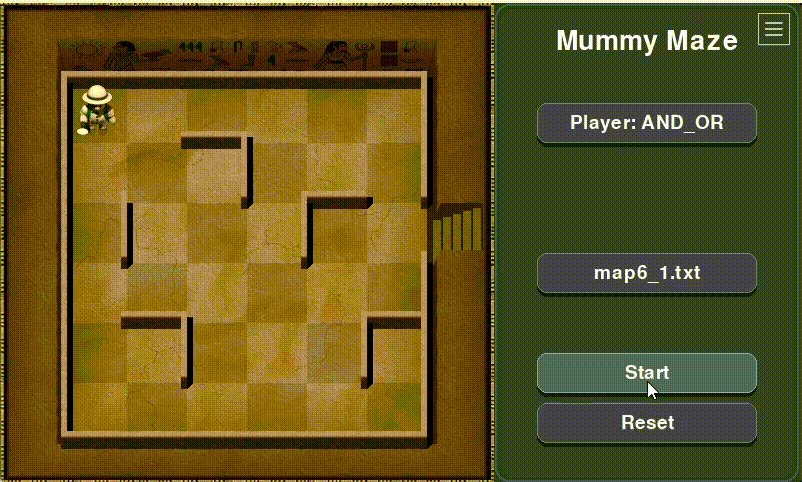

---

#### 🔹 **Belief-State Search** *(Tìm kiếm trong không gian niềm tin)*
- **Ý tưởng:** Khi **thiếu quan sát**, trạng thái là **tập các khả năng**. Kế hoạch phải thành công cho **mọi** trạng thái có thể.  
- **Ưu/nhược:** Khái quát hoá tốt partial/ẩn thông tin; **không gian trạng thái bùng nổ**.

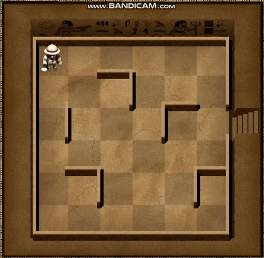

---

#### 🔹 **Partial Observation**
- **Ý tưởng:** Chỉ biết một phần bản đồ/bẫy/đối thủ; cần chiến lược **khám phá + an toàn** (thường biểu diễn qua belief state).  
- **Ưu/nhược:** Thực tế hơn; đòi hỏi xử lý **bất định** và cập nhật tri thức liên tục.

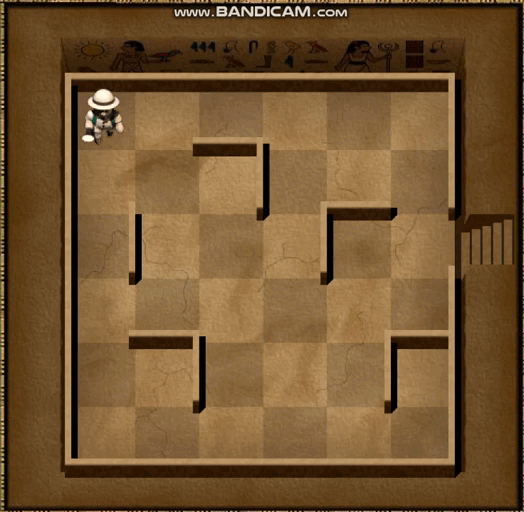

---

#### 🔹 **Backtracking (CSP)**
- **Ý tưởng:** Mô hình hoá đường đi như **chuỗi biến theo thời gian** `X₀..X_T`; thử-sai và quay lui khi vi phạm ràng buộc (kề hợp lệ/không xuyên tường/không vào bẫy/đến Goal).  
- **Ưu/nhược:** Dễ cài đặt; có thể **rất chậm** nếu không cắt tỉa tốt.

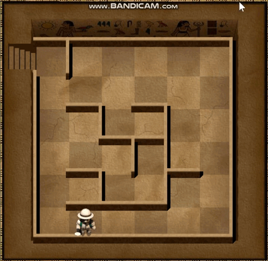

---

#### 🔹 **Forward Backtracking (CSP có suy diễn tiến)**
- **Ý tưởng:** Kết hợp backtracking với **forward checking / inference** để **cắt tỉa trước** domain các biến chưa gán, giảm lỗi muộn.  
- **Ưu/nhược:** Nhanh hơn backtracking thuần; chi phí suy diễn tăng thêm.

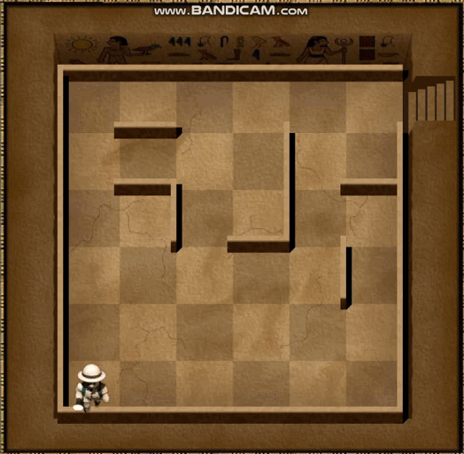

---

#### 🔹 **Arc Consistency (AC-3)**
- **Ý tưởng:** Duy trì **nhất quán cung**: với mọi giá trị của `Xi` phải tồn tại giá trị tương thích ở `Xj`; lặp cho đến khi ổn định để **thu hẹp domain** trước/khi tìm kiếm.  
- **Ưu/nhược:** Giảm mạnh không gian tìm kiếm; có thể **tốn thời gian tiền xử lý** trên đồ thị ràng buộc dày.

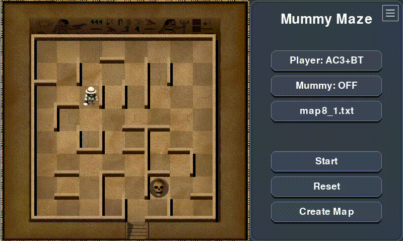

---

## 🕹️ 4. Giao diện và cách chạy chương trình

### 4.1. **Cấu trúc thư mục**
